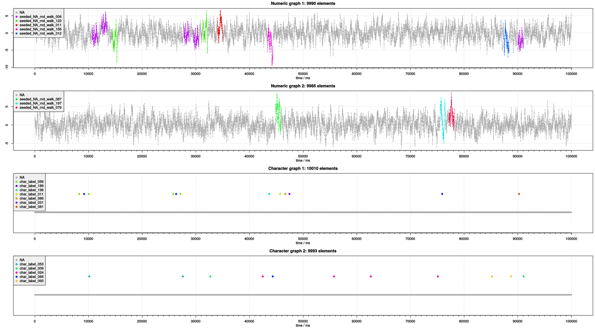

# SDG: Synthetic datastream generator


## Introduction
The **SDG** is a modular and highly configurable synthetic data stream generator implemented in the programming language R. It has the following characteristics:

* It is open source.
* It continuously generates an arbitrary number of parallel numeric and symbolic (i.e., string) data streams.
* The numeric streams are made up of repeating subsequences (motifs) which are connected via random inter-motif sequences.
* The functional forms of both motif as well as inter-motif sequences are customizable.
* The symbolic streams contain randomly emitted string labels from a predefined vocabulary.
*	The order in which subsequences and labels appear is determined by a probability distribution which is conditioned on the combined history of previously emitted labels/motifs from all dimensions.
* The complexity and ambiguity (i.e., the entropy) of said probability distribution is customizable by a set of meaningful parameters.
* The data elements of each stream are emitted in an asynchronous manner (i.e., with random delay fluctuations) and annotated with a timestamp of the time the element became available (in a real world scenario, data streams from different sensors are not necessarily synchronized).
* The numeric data elements are also annotated with a ground truth label containing information on whether they belong to a motif or to a random inter-motif sequence.

More detailed information about **SDG**'s structure and inner workings can be found in [`./doc/doc.pdf`](./doc/doc.pdf).

## Prerequisites
* Installed R (https://www.r-project.org/), we tested SDG with R version 3.4.4.
* SDG should, in theory, run under all common operating systems. We tested SDG under Windows 7 (64 bit), Ubuntu 16.04 LTS and 18.04 LTS (both 64 bit).
* In case you want to use the Shell scripts mentioned in the next section, you require a Unix-Shell like Bash. Linux systems typically come with a pre-installed Shell. On Windows, you might want to try an environment like [Cygwin](https://cygwin.com/) (this *might* work, but we did not test it).

## Installation & example run
Note: `.` represents this repository's root directory.

1. Clone this repository to your local hard drive via:  
    * Either: Console command:
        ```bash
            git clone --recurse-submodules https://github.com/GStepien/SDG.git &&
                cd SDG &&
                git fetch --tags && 
                git merge FETCH_HEAD &&
                cd ..
        ```
    * Or: Download the Shell script [`./git_clone_recursive.sh`](./git_clone_recursive.sh) from [here](https://raw.githubusercontent.com/GStepien/SDG/master/git_clone_recursive.sh), make it executable via `chmod u+x ./git_clone_recursive.sh` and execute it. The script clones this repository into the directory from which it is executed.
2. Fetching later updates:  
    * Either: Console command:
        ```bash
            git fetch && git fetch --tags && git merge FETCH_HEAD &&
                git submodule update --init --recursive &&
                git submodule update --recursive
        ```
    * Or: Execute the Shell script [`./git_pull_recursive.sh`](./git_pull_recursive.sh)
3. Example run: 
    * Source the [`./examples/visualization_01/execute.R`](./examples/visualization_01/execute.R) script via:  
        * Either: RStudio 
        * Or: By executing the following console command from SDG's root directory: `Rscript ./examples/visualization_01/execute.R`.
        * Or: By executing the Shell script [`./examples/visualization_01/execute.sh`](./examples/visualization_01/execute.sh).

The latter starts the execution of an example script that iteratively generates synthetic data until enough data elements have been accumulated in order to plot them over the whole predefined x-axis range (100 seconds) on all dimensions. The resulting plot is then stored in `./examples/visualization_01/images/datastream.svg`. This might take a few minutes and the current progress is printed to the console (the numbers in the right columns). We highly recommend to study the code in `./examples/visualization_01/execute.R` which, along with the configuration files in [`./examples/visualization_01/`](./examples/visualization_01/) and [`./examples/visualization_01/config/`](./examples/visualization_01/config/), serves as a usage template.

**Note:**

* SDG is implemented in a way that all required but missing 3rd party packages are automatically downloaded, compiled (if required) and installed via: 
```R
install.packages(pkgs = <package_name>, 
                 dependencies = TRUE, 
                 repos = "http://cran.us.r-project.org")
```
This might take some time, especially during the first SDG execution. 
* [`./LICENSE.md`](./LICENSE.md) contains a list of used 3rd party packages and links to their respective CRAN pages.
* After installation, SDG loads all required packages. Both steps (missing package installation and required package loading) are performed right at the beginning of SDG's execution.
* Depending on your OS, installation of additional libraries might be necessary. Under Ubuntu 16.04, for example, we encountered a number of errors during the package installation process. We got rid of those by typing and executing the following command in the console: `sudo apt-get install libv8-dev libcurl4-openssl-dev libssl-dev`. If and what additional libraries are required, might vary from OS to OS - the corresponding error message (and, of course, the respective package's CRAN page) should contain more information.
After you have installed all required libraries, simply re-execute the `./examples/visualization_01/execute.R` script.

## Version
Release versions correspond to commits to the `master` branch with a commit tag `<version>-RELEASE`. Checkout this version via `git checkout <version>-RELEASE`.

The current release version is: `1.0.0`.

## License
For each file in this repository:
If not explicitly licensed otherwise, the file and its contents are provided under the GNU General Public License as published by the Free Software Foundation, either version 3 of the license, or (at your option) any later version. For more details (including the usage of 3rd party packages and their respective licenses), see [`./LICENSE.md`](./LICENSE.md).

Copyright (c) 2018 Grzegorz Stepien
